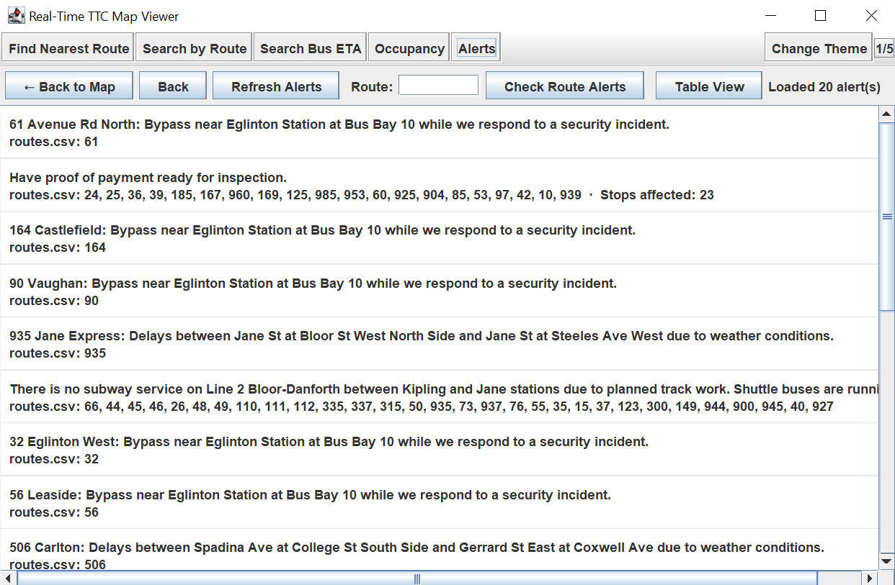

# TTC Bus Tracker — Team Project

A desktop Swing application that helps riders plan TTC bus trips using live data. Users can:
- View a city map and find the nearest route/stop to a location
- Search by route to see vehicles and locations on that route
- See bus ETAs and schedules for a stop
- Check live vehicle occupancy
- Read service alerts and disruptions

## Prerequisites
- Java 11 or newer
- Maven 3.8+
- An IDE (IntelliJ IDEA recommended) for running the desktop app

## Build and Test
From the project root:
- Build: `mvn -q -DskipTests=false clean test`
- If you prefer to just compile: `mvn -q -DskipTests clean package`

## Run the App
The project is a Swing application. The typical way to run it is from your IDE:
1. Open the project in IntelliJ IDEA (Maven will import automatically).
2. Locate the main class: `src\main\java\app\MainFrame.java`.
3. Run the `main` method.

This launches the main window and wires together all views and use-cases (map, search by route, nearest route, alerts, schedule/ETA, occupancy).

## APIs Used
The application uses the following public APIs and endpoints:

- TTC GTFS-realtime Vehicles: https://bustime.ttc.ca/gtfsrt/vehicles
    - Real-time vehicle positions, bearing, speed, trip and route references, and occupancy status (protobuf/GTFS-rt)
- TTC GTFS-realtime Alerts: https://bustime.ttc.ca/gtfsrt/alerts
    - Real-time service alerts and disruptions (protobuf/GTFS-rt)
- Nominatim Geocoding (OpenStreetMap): https://nominatim.openstreetmap.org/search
    - Forward geocoding to resolve user-entered places/addresses to coordinates (JSON)

## User Stories
1. As a user, I want to be able to see a map of Toronto with makers
2. As a user, I want to see the nearest bus stop to my current location.
3. As a user, I want to see the schedule of the buses for a given bus stop.
4. As a user, I want to see the ETA of the buses for a given bus stop.
5. As a user, I want to search any route number and see all buses/locations on that route.
6. As a user, I want to see the occupancy status of each bus in real time.
7. As a user, I want to receive alerts for delays or disruptions.

## Project Structure
- `src\main\java\app\MainFrame.java` — Application entry point.
- `src\main\java\app\AppBuilder.java` — Wires up views, presenters, interactors, and data gateways.
- `src\main\java\view` — Swing views (UI panels), e.g., AlertsView, MapView.
- `src\main\java\use_case` — Use-case interactors and input/output boundaries.
- `src\main\java\interface_adapter` — Controllers and view models.
- `src\main\java\data_access` — Gateways to external APIs.
- `src\test\java` — Unit tests for entities and use-cases.

## Demos and Media

- Demo GIF: 

- Alerts: 

---
Last updated: 2025-12-02